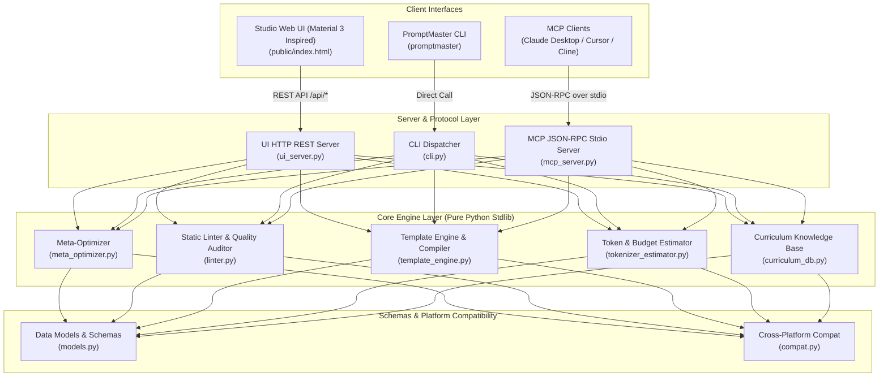

# ⚡ PromptMaster Studio

> **Zero-dependency, high-performance Prompt Engineering, Meta-Optimization, Static Linting & Model Context Protocol (MCP) Suite.**

[](https://github.com/1nc0gn30/promptmaster-studio/actions/workflows/ci.yml)
[](https://www.python.org/downloads/)
[](https://opensource.org/licenses/MIT)
[](https://modelcontextprotocol.io/)
[](https://pypi.org/project/promptmaster-studio/)

---

## 📖 Table of Contents

- [Overview](#-overview)
- [Key Features](#-key-features)
- [Architecture Diagram](#-architecture-diagram)
- [Installation & Quickstart](#-installation--quickstart)
- [Material 3 Studio UI](#-material-3-studio-ui)
- [CLI Reference Guide](#-cli-reference-guide)
- [Model Context Protocol (MCP) Setup](#-model-context-protocol-mcp-setup)
  - [Claude Desktop](#claude-desktop)
  - [Cursor IDE](#cursor-ide)
  - [Cline / Roo Code / Continue](#cline--roo-code--continue)
- [Prompt Engineering Architecture Guide](#-prompt-engineering-architecture-guide)
- [Testing & Quality Verification](#-testing--quality-verification)
- [License](#-license)

---

## 🌟 Overview

**PromptMaster Studio** is an enterprise-grade toolkit built strictly with the **Python Standard Library (100% zero external runtime dependencies)**. It elevates prompt design from ad-hoc experimentation into rigorous, testable software engineering.

PromptMaster Studio provides:
1. **Meta-Optimization Engine**: Decomposes raw, unstructured instructions into deterministic role personas, XML boundary delimiters, anti-hallucination guardrails, and Chain-of-Thought (CoT) reasoning protocols.
2. **Static Linter & Quality Scorer**: Detects vague language, prompt injection vectors, hardcoded credential leaks, and missing output contracts.
3. **Template Interpolation Compiler**: High-performance compiler supporting `{{ variable }}`, filter pipelines (`| upper`, `| json`, `| bullets`), default fallbacks (`:-default`), conditionals (`{{#if}}`), and iteration (`{{#each}}`).
4. **Multi-Model Token & Budget Analyzer**: Accurate BPE heuristics calculating token envelopes and API input costs across Anthropic Claude, OpenAI GPT-4o, Google Gemini, and Meta Llama.
5. **Native MCP Server**: Complete JSON-RPC 2.0 stdio server providing instant tool integration for Claude Desktop, Cursor, and IDE coding agents.
6. **Material 3 Studio Web UI**: A dual-pane visual development studio (design influenced by Material 3) with real-time linter meters, live variable interpolation, and interactive curriculum drawers.

---

## 🏛 Architecture Diagram



---

## 🚀 Installation & Quickstart

### 1. Install via pip

```bash
# Clone the repository
git clone https://github.com/promptmaster/promptmaster-studio.git
cd promptmaster-studio

# Install in editable mode
pip install -e .
```

### 2. Verify Zero External Dependencies

PromptMaster Studio has **zero** third-party requirements at runtime:

```bash
python -c "import promptmaster_studio; print('PromptMaster ready!')"
```

---

## 🎨 Material 3 Studio UI (Design influenced by Material 3)

Launch the embedded visual studio web interface:

```bash
promptmaster serve --port 8000 --open
```

Visit **`http://localhost:8000/`** to access:
- **Dual-Pane Studio Editor**: Type raw prompts on the left and see live, syntax-formatted target transformations (Anthropic XML, OpenAI Chat, Google Gemini, CoT Reasoning) on the right.
- **Live Dynamic Variable Form**: Automatically detects `{{ variable }}` tags and provides instant form fields with live rendering.
- **Real-Time Quality & Security Gauges**: Real-time Clarity, Structure, and Security score meters with interactive linter violation badges.
- **Token & Cost Calculator**: Live multi-model token counts and per-query USD pricing estimates.
- **Curriculum Drawer**: Interactive prompt engineering knowledge base and practical exercises.

---

## 🛠 CLI Reference Guide

The `promptmaster` CLI provides a complete suite of developer tools:

### 1. Meta-Optimize a Prompt
```bash
# Transform raw prompt into Anthropic XML format
promptmaster optimize "Review this Python code for bugs" --target anthropic --cot

# Format for OpenAI system / developer structure
promptmaster optimize "Analyze customer churn data" --target openai

# Format for Google Gemini grounded instructions
promptmaster optimize "Explain quantum computing" --target gemini

# Output formatted JSON
promptmaster optimize "Refactor SQL queries" --json
```

### 2. Static Prompt Linter & Quality Audit
```bash
promptmaster lint "Please kindly do some stuff with things if possible."
```

### 3. Template Rendering
```bash
promptmaster render "Hello {{name}}, welcome to {{place}}!" -V name=Neo -V place=Zion
```

### 4. Token & Cost Estimation
```bash
promptmaster tokens "Your prompt context text here..." --model claude
promptmaster tokens "Your prompt context text here..." --model gpt4o
```

### 5. Built-in Templates Directory
```bash
# List all templates
promptmaster templates

# Inspect a specific template
promptmaster templates --id code_reviewer
```

### 6. Interactive Curriculum
```bash
# List all lessons
promptmaster curriculum

# Study lesson 1
promptmaster curriculum --lesson l1
```

### 7. Diagnostics & Self-Test
```bash
promptmaster diagnostics
promptmaster test
```

---

## 🔌 Model Context Protocol (MCP) Setup

PromptMaster Studio exposes native Model Context Protocol (MCP) capabilities over stdio.

### Claude Desktop

Add this configuration to your `claude_desktop_config.json`:

- **macOS**: `~/Library/Application Support/Claude/claude_desktop_config.json`
- **Windows**: `%APPDATA%\Claude\claude_desktop_config.json`
- **Linux**: `~/.config/Claude/claude_desktop_config.json`

```json
{
  "mcpServers": {
    "promptmaster": {
      "command": "python",
      "args": ["-m", "promptmaster_studio.mcp_server"]
    }
  }
}
```

### Cursor IDE

In Cursor:
1. Go to **Settings** -> **Features** -> **MCP**.
2. Click **+ Add New MCP Server**.
3. Set **Name**: `promptmaster`
4. Set **Type**: `command`
5. Set **Command**: `python -m promptmaster_studio.mcp_server`

### Cline / Roo Code / Continue

In your extension MCP configuration settings:

```json
{
  "name": "promptmaster",
  "command": "python",
  "args": ["-m", "promptmaster_studio.mcp_server"]
}
```

### Available MCP Tools

| Tool Name | Description |
| :--- | :--- |
| `prompt_optimize` | Transforms raw prompt into enterprise XML/CoT structured format. |
| `prompt_lint` | Audits prompt clarity, security leaks, and output formatting. |
| `prompt_interpolate` | Renders templates with dynamic variable inputs. |
| `prompt_estimate_tokens` | Calculates token budgets and context window limits. |
| `prompt_templates` | Lists or inspects production-ready prompt templates. |
| `prompt_curriculum` | Fetches lessons and prompt engineering best practices. |
| `prompt_diagnostics` | Reports platform environment and telemetry health. |

---

## 🧠 Prompt Engineering Architecture Guide

### 1. Anthropic Claude (XML Semantic Delimiters)
Anthropic models perform best when instructions, context, and input data are enclosed in semantic XML tags:
```xml
<instructions>
Execute the requested analysis with maximum rigor.
</instructions>

<context>
{{ background_material }}
</context>

<constraints>
- Maintain factual precision.
- Do not extrapolate beyond verified context.
</constraints>

<output_format>
Provide response in GitHub-flavored Markdown.
</output_format>
```

### 2. OpenAI (System / Developer Message Decomposition)
OpenAI models benefit from explicit role definition and Markdown headers:
```markdown
# Role & Directive
You are a Principal Software Architect.

## Instructions
- Analyze system bottlenecks.
- Provide modular code refactorings.

## Output Format
RFC 8259 compliant JSON.
```

### 3. Google Gemini (Grounded Instructions)
Gemini excels with grounded structural priming and boundary rules:
```markdown
# Task: Financial Document Analysis
## Guidelines & Instructions
- Extract all line-item revenues and operating margins.
## Operational Boundaries
* State "Insufficient information" if data is absent.
```

---

## 🧪 Testing & Quality Verification

Run the comprehensive pytest suite:

```bash
pytest --verbose
```

Or run the built-in standalone test runner (no test runner dependencies required):

```bash
promptmaster test
```

---

## 📄 License

MIT License. See [LICENSE](LICENSE) for details. Developed with ❤️ for enterprise prompt engineers and AI application developers.
